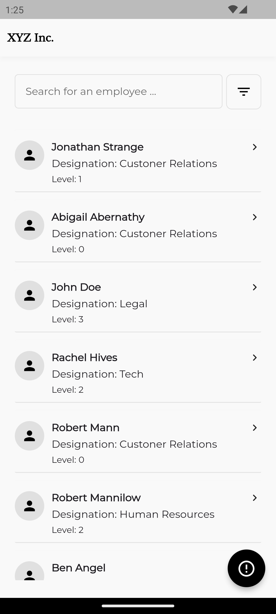
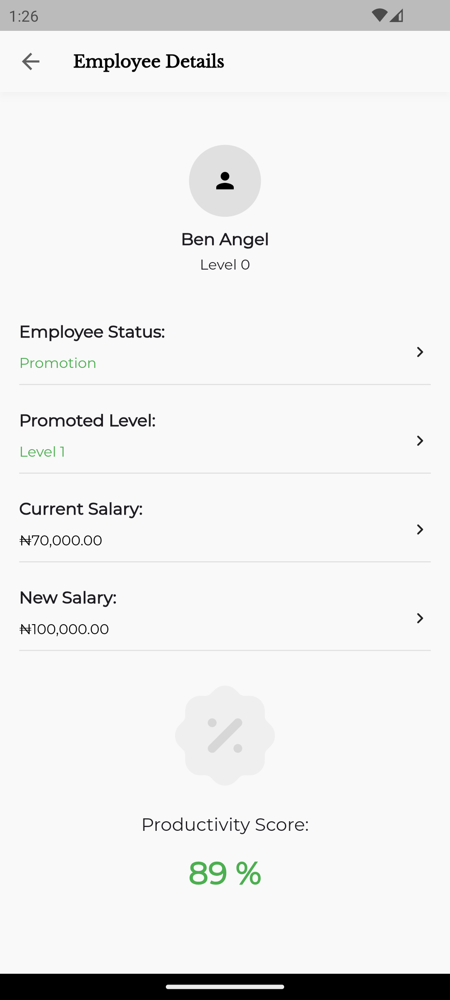
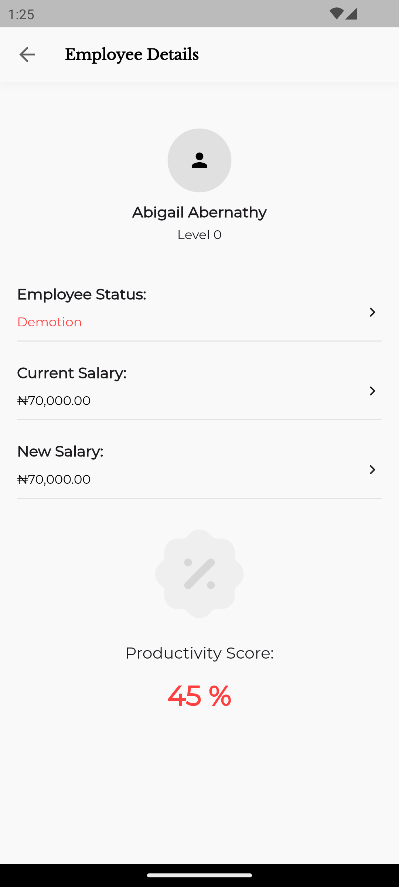
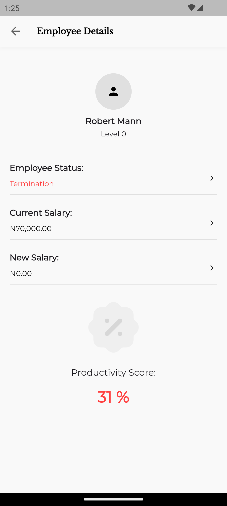
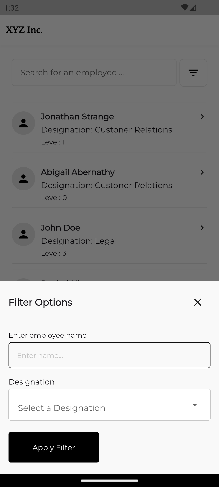

# XYZ Inc. Employee Status and Productivity Automation System

This project aims to automate the process of determining employee status at XYZ Inc. based on their yearly productivity scores. The mobile system handles employee data, evaluates their status, and calculates new salaries according to pre-set levels.

## Mobile View Screenshots

<div style="display: flex; flex-wrap: wrap; gap: 10px;">
  
  
  
  
  
</div>

## Features

### Employee List:
- Retrieve and display employee data via API Data (Api.successResponse).
- Store employee data in a local SQLite database (using SQFlite for offline access).

### Employee Filtering:
- Filter employees by name, designation to easily find and view their details.

### Employee Details:
- Upon tapping an employee, view detailed information including their new salary and employment status (promotion, demotion, termination).

### Salary Calculation:
- Level 0 = ₦70,000
- Level 1 = ₦100,000
- Level 2 = ₦120,000
- Level 3 = ₦180,000
- Level 4 = ₦200,000
- Level 5 = ₦250,000

### Status Based on Productivity Score:
- 100 – 80: Promotion with a pay increase.
- 79 – 50: No change.
- 49 – 40: Demotion (Level 0 employees cannot be demoted).
- 39 and below: Termination.

### Simulate Error Response:
- A simulated error response (Api.errorResponse) to handle scenarios where the API fails.

## Requirements

- Flutter version 3.24.5
- Dart version 3.5.4
- Android/iOS mobile device or emulator
- SQFlite for local database
- BLoC Cubit for state management
- API access to fetch employee data
- Ability to simulate API error responses

## Installation

1. Clone this repository:
    ```bash
    git clone https://github.com/yourusername/xyz-inc-employee-automation.git
    ```

2. Install dependencies:
    ```bash
    flutter pub get
    ```

3. Set up your local SQLite database using SQFlite.

4. Use the provided API endpoints or mock them for testing.

5. Run the app on your mobile device/emulator:
    ```bash
    flutter run
    ```

## Usage

- **Home Screen**: View a list of all employees and filter them based on name, designation, or level.
- **Employee Details**: Tap on an employee to view their details, status, and updated salary.
- **Simulate Error**: Trigger error responses for testing by simulating failed API calls.

## State Management

This project uses **BLoC Cubit** for state management to handle the flow of employee data and UI state transitions.

## License

This project is licensed under the MIT License – see the LICENSE file for details.